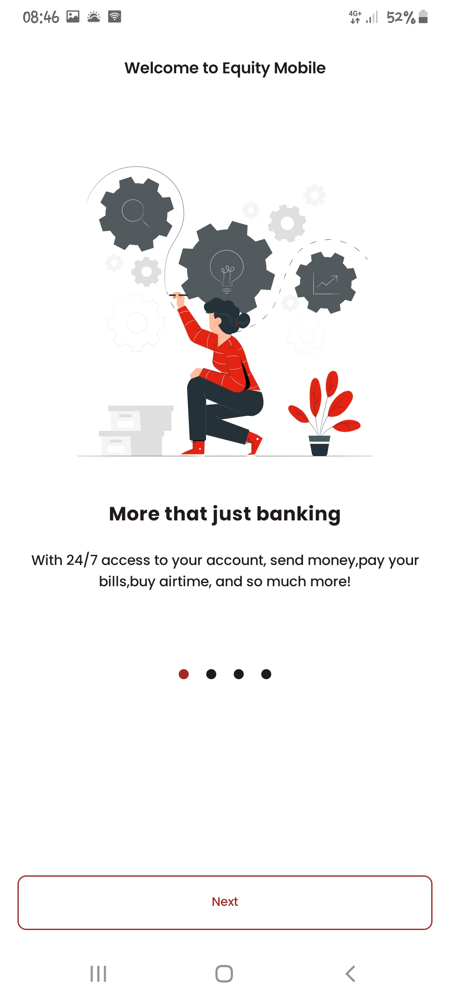
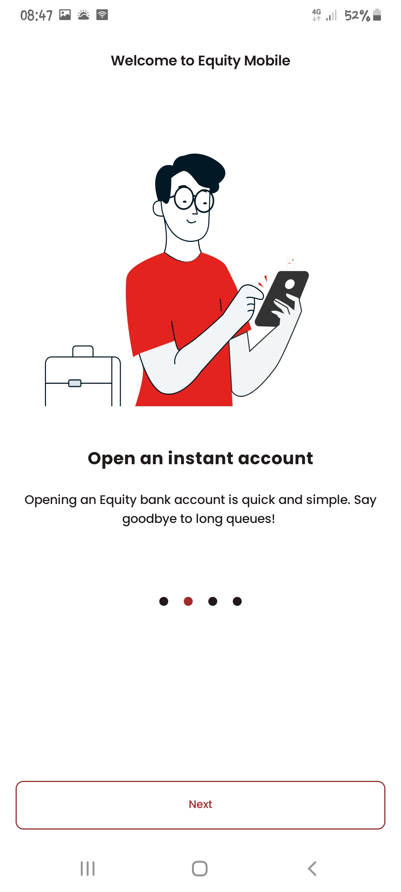
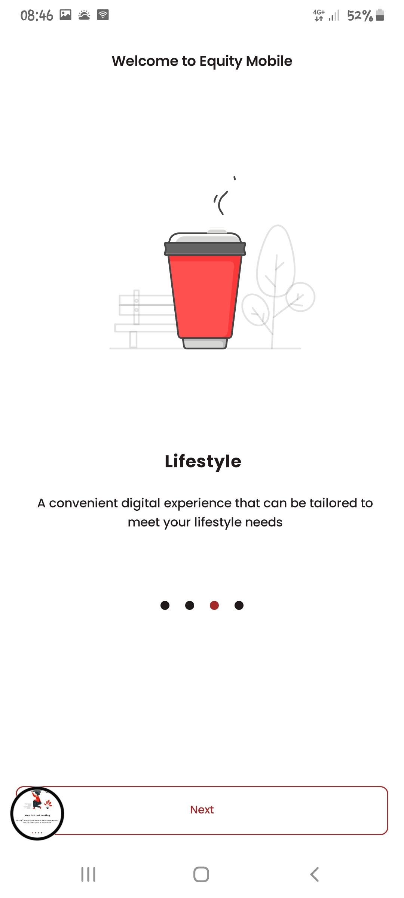
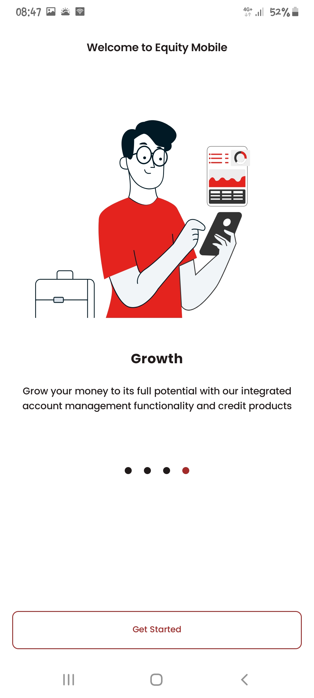
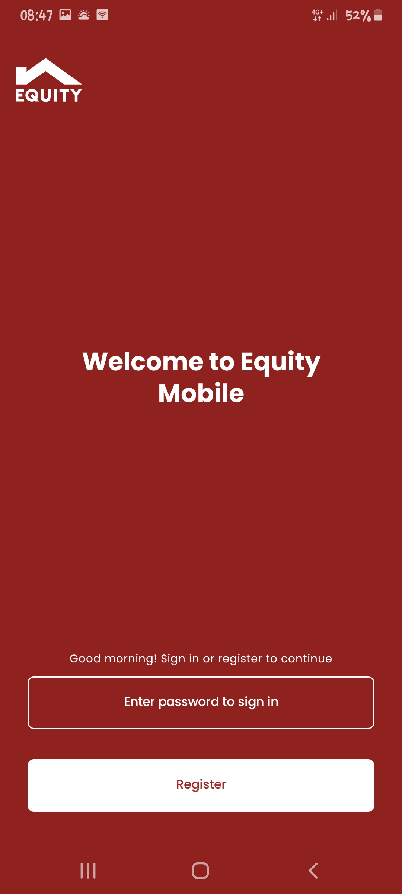
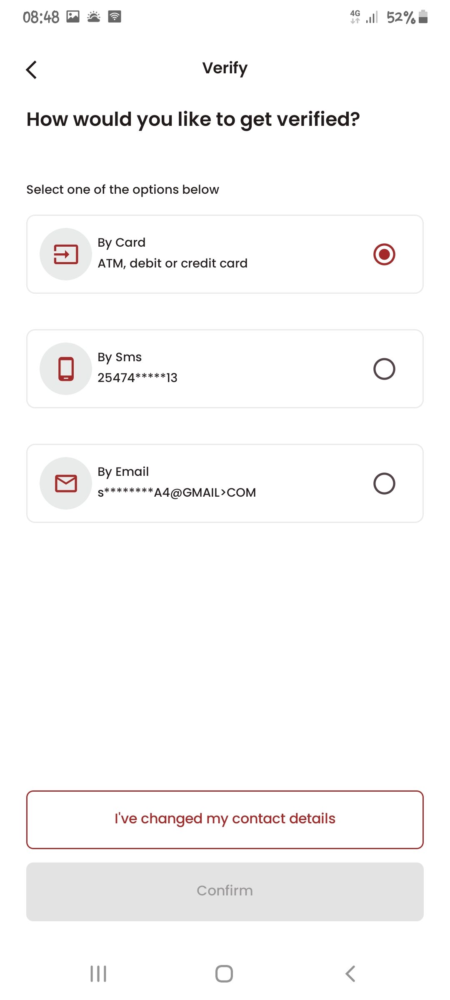
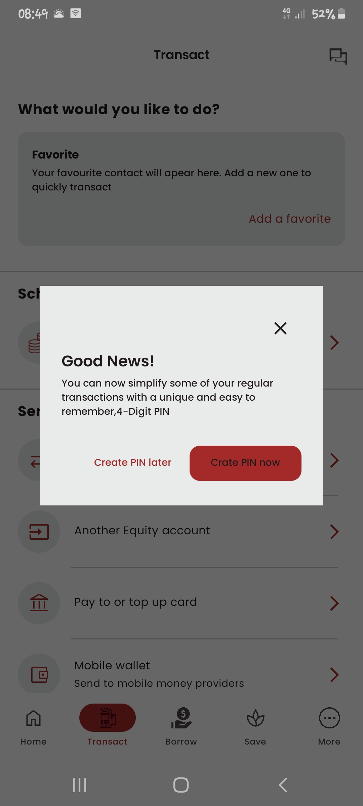
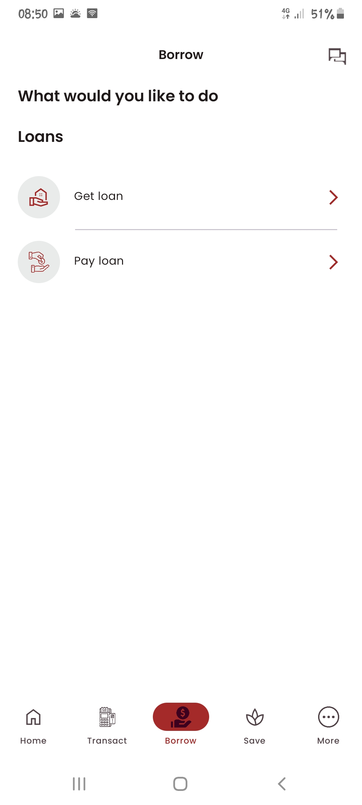
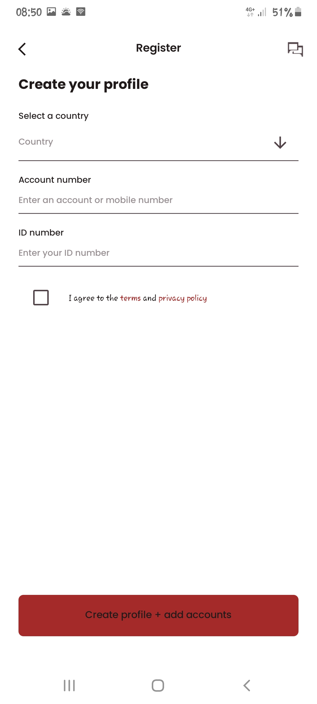

# EquityMobile

EquityMobile is an Android application developed using modern Android development practices. The app is built using Jetpack Compose, the latest UI toolkit for Android, along with other contemporary libraries and tools available in the Android ecosystem.

## Project Structure

The project is organized into multiple modules, each responsible for different features or components. Here's an overview of the main modules:

- **app**: The main application module. This is where the app's entry point resides.
- **feature:auth**: Handles user authentication and authorization.
- **feature:transaction**: Manages user transactions and financial activities.
- **feature:loans**: Provides functionality related to loans and credit.
- **feature:home**: The app's home screen module.
- **feature:savings**: Manages user savings and investments.
- **data**: Contains data-related code, including repositories and data sources.
- **domain**: Holds the business logic and domain models.
- **core:ui**: Provides core UI components and utilities used across the app, built with Jetpack Compose.
- **core:util**: Contains utility functions and classes used throughout the project.
- **core-database**: Handles database operations and room entities.
- **core-network**: Handles network operations and API interactions.
- **feature:more**: Handles additional app features.
- **feature:onboarding**: Manages user onboarding experiences.
- **common**: Contains common utilities and dependencies shared across modules.

## Key Libraries and Dependencies

The project utilizes a wide range of libraries to enhance development and maintain code quality. Some of the key libraries include:

- [Jetpack Compose](https://developer.android.com/jetpack/compose): The modern Android UI toolkit for building native UIs declaratively.
- [Dagger Hilt](https://dagger.dev/hilt/): A dependency injection library for Android.
- [Kotlin Coroutines](https://kotlinlang.org/docs/coroutines-overview.html): For managing asynchronous programming.
- [Retrofit](https://square.github.io/retrofit/): A type-safe HTTP client for Android and Java.
- [Firebase](https://firebase.google.com/): Integrations for cloud services like messaging, crash reporting, and analytics.
- [Room](https://developer.android.com/jetpack/androidx/releases/room): Android's official persistence library.
- [Accompanist](https://google.github.io/accompanist/): A collection of extension libraries for Jetpack Compose.
- [Detekt](https://detekt.github.io/detekt/): A static code analysis tool for Kotlin.
- [KtLint](https://ktlint.github.io/): A Kotlin linter for ensuring consistent code style.
- ...and more.

For a comprehensive list of dependencies, please refer to the provided `build.gradle` files.

## Building and Running the App

To build and run the app, follow these steps:

1. Clone this repository.
2. Open the project in Android Studio.
3. Select the desired module and run the app.

## Contributing

We welcome contributions to EquityMobile! If you want to contribute, please fork the repository and submit pull requests. Make sure to adhere to the project's code style and guidelines.

Still on-progress
## Light Theme
      
    
    
    
    
    
    

## Dark Theme
       
       
       
     
     
           

